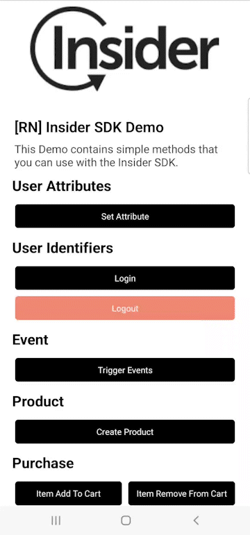

# ReactNativeDemo

<p align="center">
  
  
  <table align="center">
    <tr>
      <td><a href="https://useinsider.com/"> Insider </a></td>
      <td><a href="https://www.npmjs.com/package/react-native-insider/"> NPM JS react-native-insider </a></td>
      <td><a href="https://academy.useinsider.com/docs/react-native-integration"> InsiderAcademy </a></td>
    </tr>
  </table>
</p>  

## Description

This Demo contains simple methods that you can use with the Insider SDK.

## Preview

<table align="center">
  <tbody>
    <tr>
      <td></td>
    </tr>
  </tbody>
</table>


## Installation

Install all npm packages by running the `npm install` command in the home directory.

Replace partner name and app group value in `App.tsx` with your info.

Note: Can easily find the warnings added as comments by searching the `FIXME-INSIDER` key in the project and you can quickly make the necessary arrangements for the project.

### Android

1. Add `google-services.json` and `agconnect-services.json` to `android/app` folder.
2. Add your keystore file to `android/app` folder and replace `signingConfigs` attributes in `android/app/build.gradle` file with your info.
3. Replace manifestPlaceholders -> partner value with your partner name in `android/app/build.gradle` file. (This step is important to add test device with QR or Email in the panel.)
4. And run project with `npm run android` command.

### iOS

1. Go to the iOS folder with terminal and run the `pod install` command.
2. Open XCode and check the app group and bundle identifier for all targets.
3. Replace `insider` URL type in main target Info -> URL Types with your partner name. (This step is important to add test device with QR or Email in the panel.)
4. Change APP_GROUP variables value in `InsiderNotificationService/NotificationService.m` and `InsiderNotificationContent/NotificationViewController.m` files.
5. And run project with XCode. 


## About Universal Links

### Android

1. Replace URL in AndroidManifest.xml file with your domain.

Note: 
If you are not directed to the application when you click on the URL or scan it with QR, you may not have done the verify step for the URL you set. 
To solve this problem, open the "Supported web addresses" settings from the "Set as default" settings in the application settings and enable the URL you set.

Ref: https://developer.android.com/training/app-links/verify-android-applinks

### iOS

1. Release app link in Associated Domain with your domain for main target.

If you are not directed to the application when you click on the URL or scan it with QR, you may not have done the verify step for the URL you set.
To solve this problem, you can add a verification file to the root directory of your domain.

Ref: https://developer.apple.com/documentation/xcode/supporting-associated-domains

## Troubleshooting

### Missing node version
You will see the following error upon building the project:
> [Warning] You need to configure your node path in the `".xcode.env" file` environment.  You can set it up quickly by running:  `echo export NODE_BINARY=$(command -v node) > .xcode.env`  in the ios folder. This is needed by React Native to work correctly.  
> We fallback to the DEPRECATED behavior of finding `node`. This will be REMOVED in a future version.  You can read more about this here: https://reactnative.dev/docs/environment-setup#optional-configuring-your-environment 
> /Users/youruser/Library/Developer/Xcode/DerivedData/ReactNativeDemo-armazsjamjdnozdegphlbkfgioxp/Build/Intermediates.noindex/Pods.build/Debug-iphonesimulator/hermes-engine.build/Script-46EB2E00022190.sh: line 9: : command not found
Command PhaseScriptExecution failed with a nonzero exit code

In order to circumvent this, you need to export your node version into `.xcode.env` (and `.xcode.env.local` just in case) file.

```bash
echo export NODE_BINARY=$(command -v node) > ios/.xcode.env
echo export NODE_BINARY=$(command -v node) > ios/.xcode.env.local
```